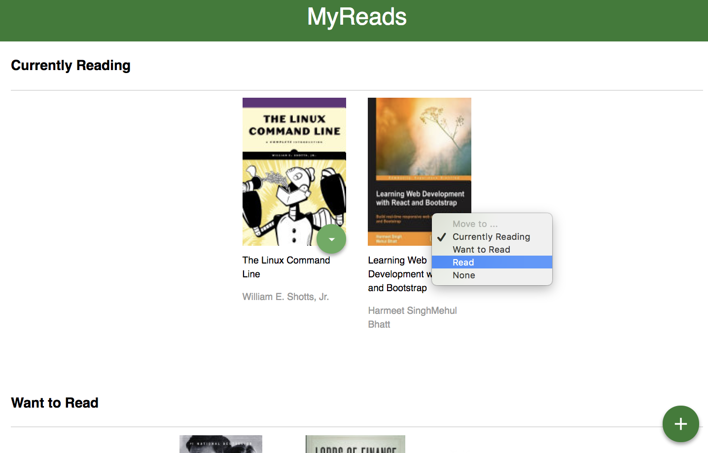
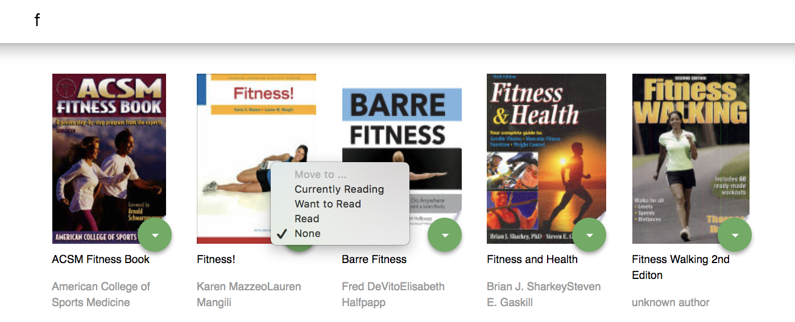

# MyReads Project

MyReads Project is a bookshelf app that allows you to select and categorize books you have read, are currently reading, or want to read. It is built with [Create React App](https://github.com/facebookincubator/create-react-app).

# App Functionsbookshelves
The ReadsPage displays three shelves.

1. Currently reading
2. Want to read
3. Read 

Every book has a drop-down list of shelves, which allows you to select and move your book. 

The SearchPage allows you to search books by name or author. 

# Project Screenshots
## ReadPage

## SearchPage

## Instructions for installment

* clone my repo `https://github.com/mavisluan/my-reads.git`
* install all project dependencies with `npm install`
* start the development server with `npm start`

## Important
The backend API uses a fixed set of cached search results and is limited to a particular set of search terms, which can be found in [SEARCH_TERMS.md](SEARCH_TERMS.md). That list of terms are the _only_ terms that will work with the backend, so don't be surprised if your searches for Basket Weaving or Bubble Wrap don't come back with any results.

